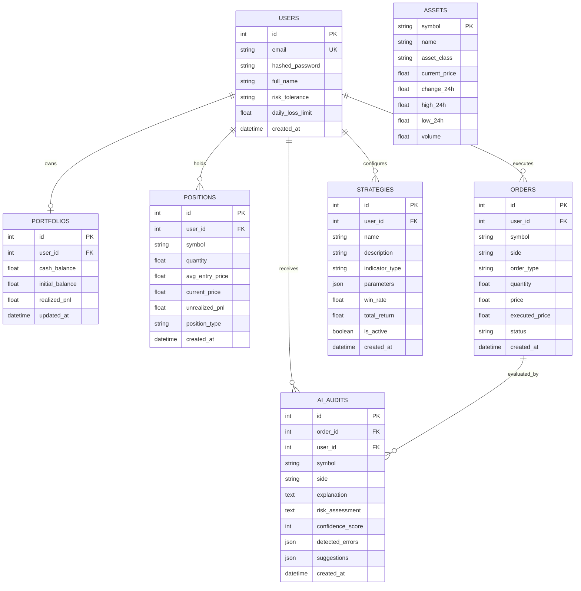

# QuantBot Database ERD (Entity Relationship Diagram)

```mermaid
erDiagram
    USERS ||--o| PORTFOLIOS : owns
    USERS ||--o{ POSITIONS : holds
    USERS ||--o{ ORDERS : executes
    USERS ||--o{ STRATEGIES : configures
    USERS ||--o{ AI_AUDITS : receives
    ORDERS ||--o{ AI_AUDITS : evaluated_by

    USERS {
        int id PK
        string email UK
        string hashed_password
        string full_name
        string risk_tolerance
        float daily_loss_limit
        datetime created_at
    }

    PORTFOLIOS {
        int id PK
        int user_id FK
        float cash_balance
        float initial_balance
        float realized_pnl
        datetime updated_at
    }

    ASSETS {
        string symbol PK
        string name
        string asset_class
        float current_price
        float change_24h
        float high_24h
        float low_24h
        float volume
    }

    POSITIONS {
        int id PK
        int user_id FK
        string symbol
        float quantity
        float avg_entry_price
        float current_price
        float unrealized_pnl
        string position_type
        datetime created_at
    }

    ORDERS {
        int id PK
        int user_id FK
        string symbol
        string side
        string order_type
        float quantity
        float price
        float executed_price
        string status
        datetime created_at
    }

    STRATEGIES {
        int id PK
        int user_id FK
        string name
        string description
        string indicator_type
        json parameters
        float win_rate
        float total_return
        boolean is_active
        datetime created_at
    }

    AI_AUDITS {
        int id PK
        int order_id FK
        int user_id FK
        string symbol
        string side
        text explanation
        text risk_assessment
        int confidence_score
        json detected_errors
        json suggestions
        datetime created_at
    }
```
